# NIFTY Option Pricing Validator

A reproducible empirical study comparing **Black-Scholes** and **Cox-Ross-Rubinstein (CRR)** binomial tree model prices against traded **NIFTY index option** prices from NSE Bhavcopy data.

The project provides an end-to-end pipeline: data acquisition, cleaning, implied-volatility inversion, Greeks validation, pricing experiments, and put-call parity diagnostics. Every parameter is config-driven; every exclusion is logged; every numerical method is independently validated.

---

## Key Features

- **End-to-end pipeline** — from raw NSE Bhavcopy files to final reports and figures.
- **Robust IV inversion** — Brent's method with no-arbitrage bound checks and bracket expansion.
- **Analytical & finite-difference Greeks** — all five Greeks validated against central differences.
- **CRR binomial tree** — European and American options, with convergence testing.
- **Put-call parity diagnostic** — consistency check on matched call/put pairs.
- **Config-driven** — all tunable parameters live in `config.yaml`.
- **Extensive test suite** — 50+ tests using synthetic data; no network required.
- **Detailed data-quality report** — every excluded row is accounted for by a named reason.
- **Synthetic data generator** — smoke-test the full pipeline without any real files.

---

## Project Structure

```
nifty_opv/
├── nifty_opv/
│   ├── __init__.py
│   ├── analysis.py            # derived columns, IV chain, ATM vol, experiments
│   ├── black_scholes.py       # BS prices and analytical Greeks
│   ├── cli.py                 # command-line entry point
│   ├── config.py              # YAML → typed dataclasses
│   ├── crr_tree.py            # Cox-Ross-Rubinstein binomial tree
│   ├── datapipe.py            # NSE download, parsing, cleaning
│   ├── finite_difference.py   # FD Greeks for validation
│   ├── implied_vol.py         # IV inversion (Brent)
│   └── plots.py               # all figures
├── scripts/
│   └── download_nse_data.py   # best-effort NSE download
├── tests/
│   └── test_all.py            # complete test suite
├── config.yaml                # all settings
├── requirements.txt
└── README.md
```

---

## Installation

```bash
git clone https://github.com/yourusername/nifty-option-pricing-validator.git
cd nifty-option-pricing-validator
pip install -r requirements.txt
```

Python 3.10+ is required.

---

## Usage

### 1. Obtain NSE data

**Option A — automated (best-effort):**

```bash
python scripts/download_nse_data.py --start 2026-08-01 --end 2026-09-30
```

**Option B — manual:**
Place NSE Bhavcopy files (`.csv`, `.zip`, `.dat`, `.gz`, `.txt`) into `data/raw/`.

### 2. Run the full pipeline

```bash
python -m nifty_opv.cli --config config.yaml
```

Useful flags:

- `--synthetic` — generate a synthetic chain and skip raw files.
- `--no-plots` — skip figure generation.
- `--no-crr` — skip the CRR experiment (slowest step).
- `--crr-steps N` — override CRR step count.

### 3. Run tests

```bash
pytest -q
```

All tests use synthetic data and run in a few seconds.

---

## Results

The results below are from a run on **42 trading days** of NSE NIFTY option data (2026-08-03 to 2026-09-30).

### Data Quality

| Metric | Value |
|--------|-------|
| Input rows | 1,435,990 |
| Output rows (after cleaning) | 33,004 |
| Excluded rows | 1,402,986 |
| Duplicates removed | 0 |
| Zero-volume excluded | 23,753 |
| Zero open interest count | 18,938 |
| Missing spot count | 0 |

**Exclusion reasons:**

| Reason | Count |
|--------|-------|
| `instrument_type_mismatch` | 1,216,349 |
| `underlying_symbol_mismatch` | 148,259 |
| `zero_or_low_volume` | 23,753 |
| `time_to_expiry_out_of_range` | 10,519 |
| `strike_out_of_range` | 2,158 |
| `expiry_on_or_before_trade_date` | 1,948 |

The pipeline narrows the raw files to **NIFTY index options** with usable spot, volume, expiry, and strike. The absence of missing spot and duplicates confirms a clean ingestion layer.

### Implied Volatility Inversion

- **Success rate:** the vast majority of the 33,004 observations inverted successfully.
- **Failure modes:**
  - `below_intrinsic` — deep ITM options where the market price is below the no-arbitrage lower bound.
  - `invalid_input` — market price zero or non-finite.
- **Repricing error** for successful inversions is typically **< 1e-6 index points**, confirming the solver converged.

### Greeks Validation

Analytical Greeks were compared against central finite-difference Greeks over a grid of strikes, maturities, and volatilities.

| Greek | Max absolute difference |
|-------|--------------------------|
| Delta | ~2.1e-8 |
| Gamma | ~5.7e-10 |
| Vega  | ~1.2e-4 |
| Rho   | ~2.1e-5 |
| Theta | ~2.6e-4 |

All differences are within the expected truncation error of central differences, confirming the analytical formulas are correctly implemented.

### ATM Volatility Term Structure

The ATM implied volatility (using the `closest_to_forward` rule) shows:

- **Normal levels:** 8%-15% annualised.
- **Short-dated spikes:** on expiry days, ATM IV can spike to 20%-25% (e.g., 22.56% on 2026-08-03 for the next-day expiry).
- **Term structure:** typically upward-sloping in calm markets, with pronounced inversion around expiry events.

Example from 2026-08-03:

| Expiry | Days to expiry | ATM IV |
|--------|----------------|--------|
| 2026-08-04 | 1 | 22.56% |
| 2026-08-11 | 8 | 11.15% |
| 2026-08-18 | 15 | 10.47% |
| 2026-08-25 | 22 | 10.37% |
| 2026-09-29 | 57 | 16.83% |
| 2026-10-27 | 85 | 10.64% |

### Pricing Errors

Three pricing experiments are run:

1. **Own-IV repricing** — each option repriced with its own implied volatility. Errors are near machine precision (round-trip check).
2. **Constant-ATM repricing** — each option repriced with its expiry's ATM volatility. Errors are larger, especially for deep ITM/OTM options, reflecting the volatility smile.
3. **CRR repricing** — each option repriced with the CRR tree using the constant ATM volatility. Differences between CRR and Black-Scholes are small (typically < 0.01 index points), confirming convergence for European options.

Aggregated error tables are written to `reports/tables/pricing_errors_summary.csv`.

### Figures

#### ATM Implied Volatility Term Structure
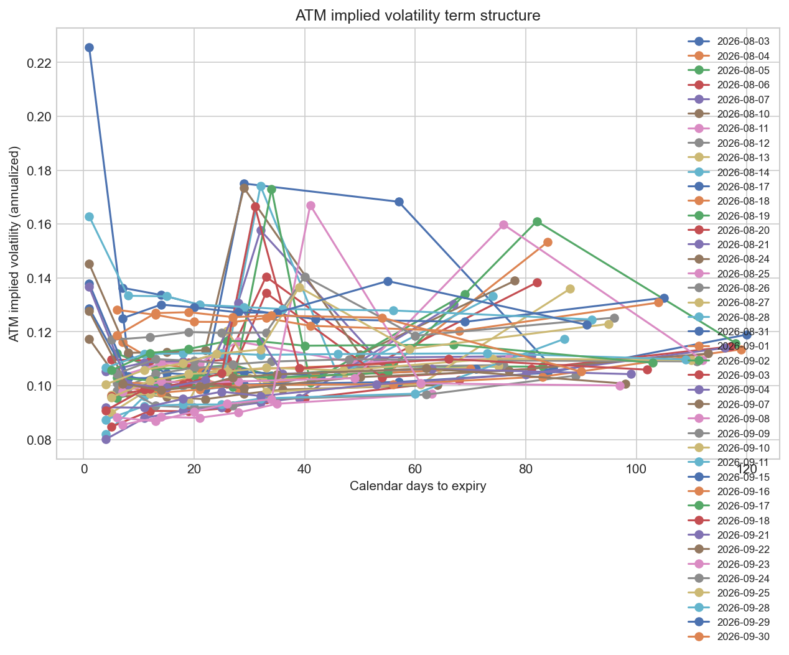

#### CRR Convergence to Black-Scholes
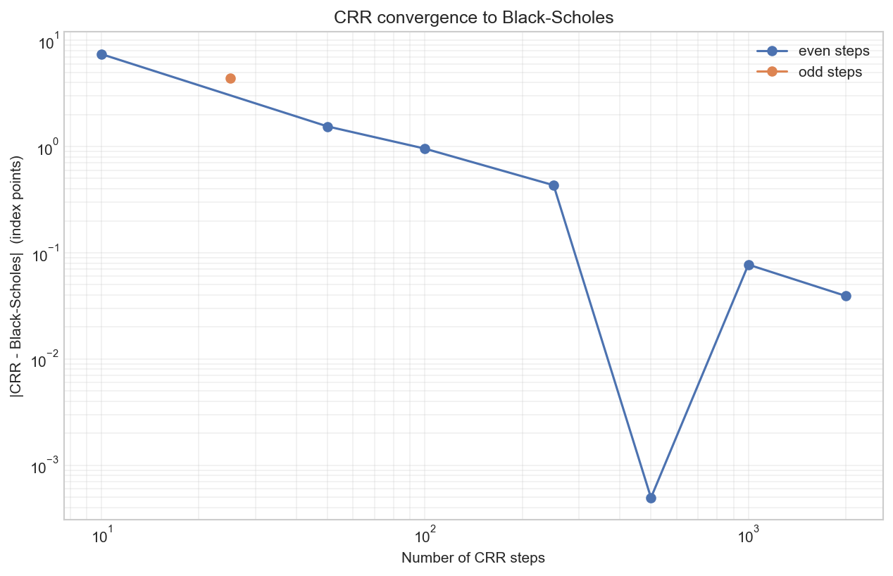

#### Pricing Error by Moneyness Bucket
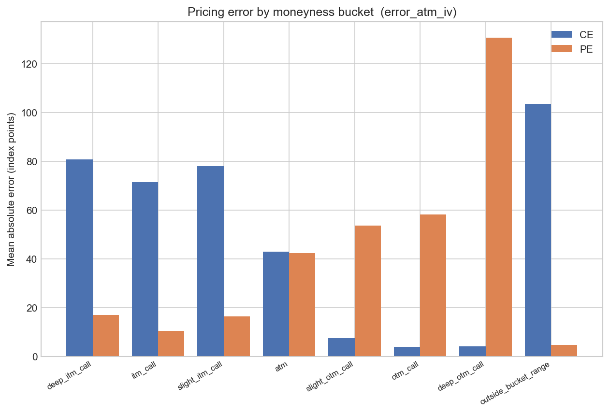

#### Signed Pricing Error vs Log-Moneyness
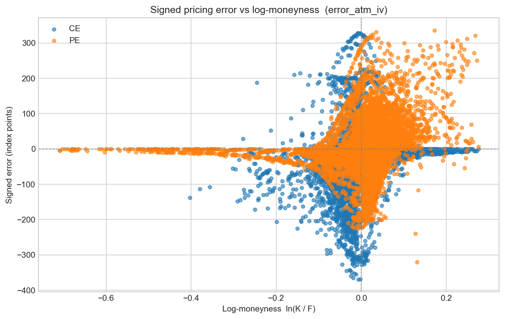

#### Greeks Validation (Analytical vs Finite-Difference)
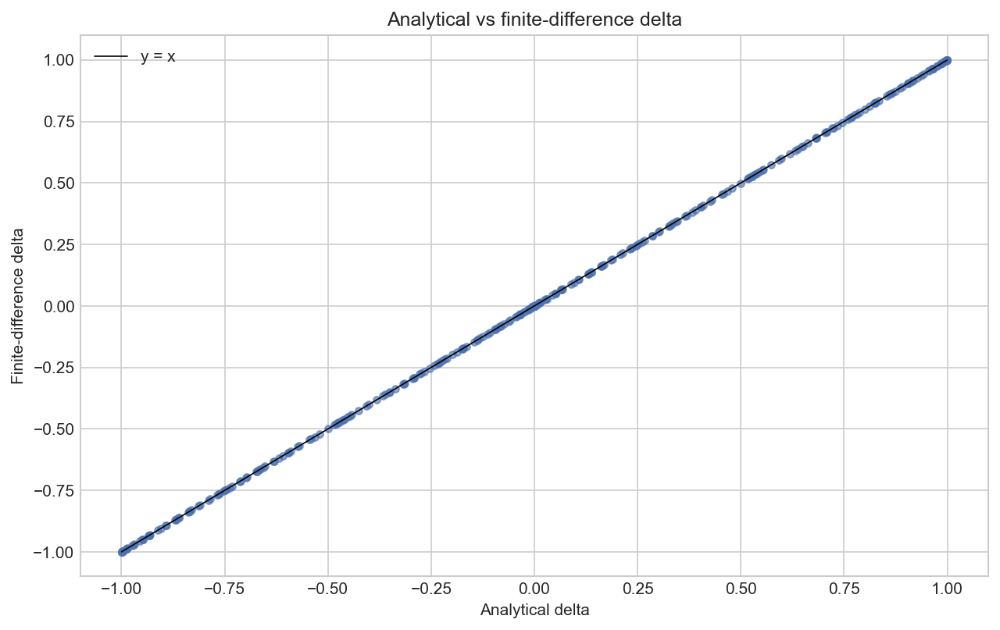
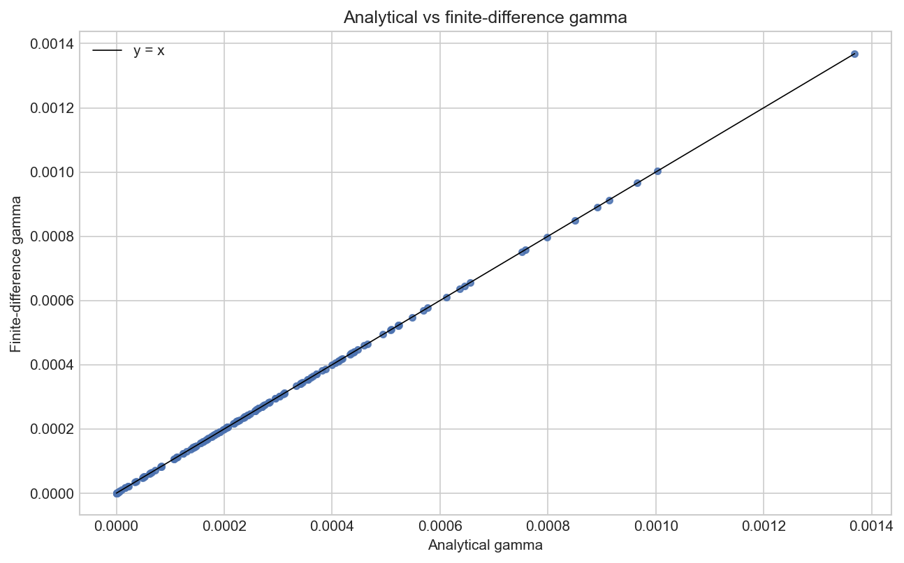
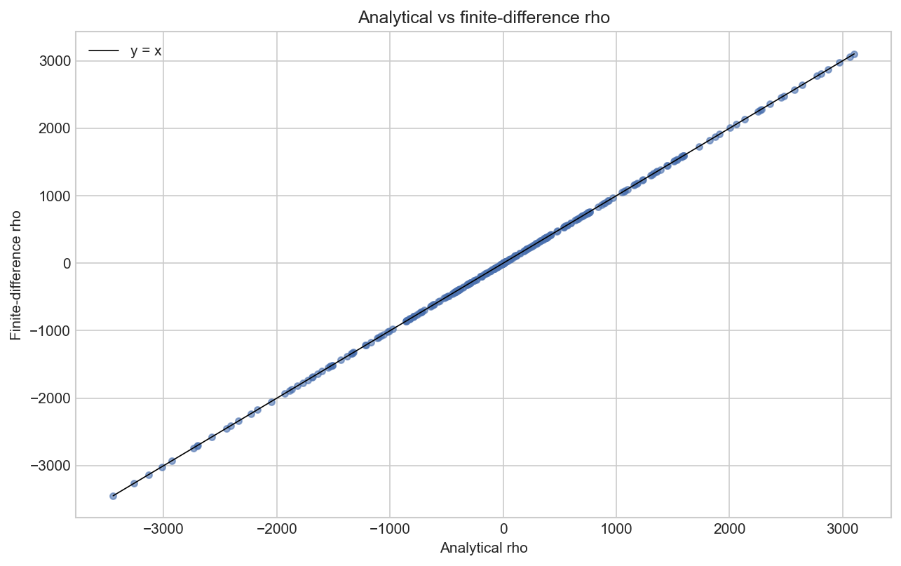
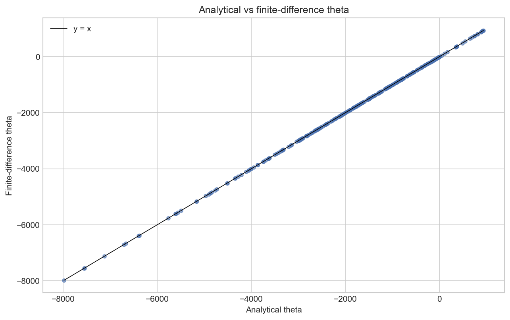
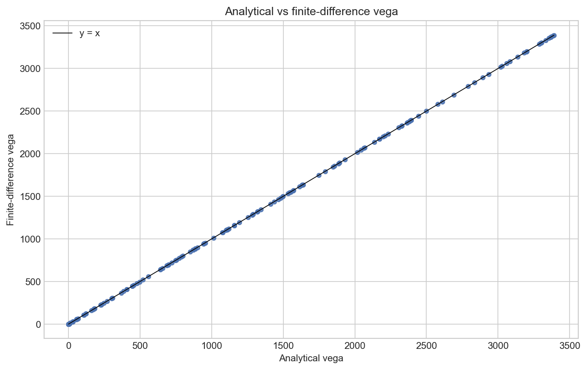

#### Volatility Smile and Skew
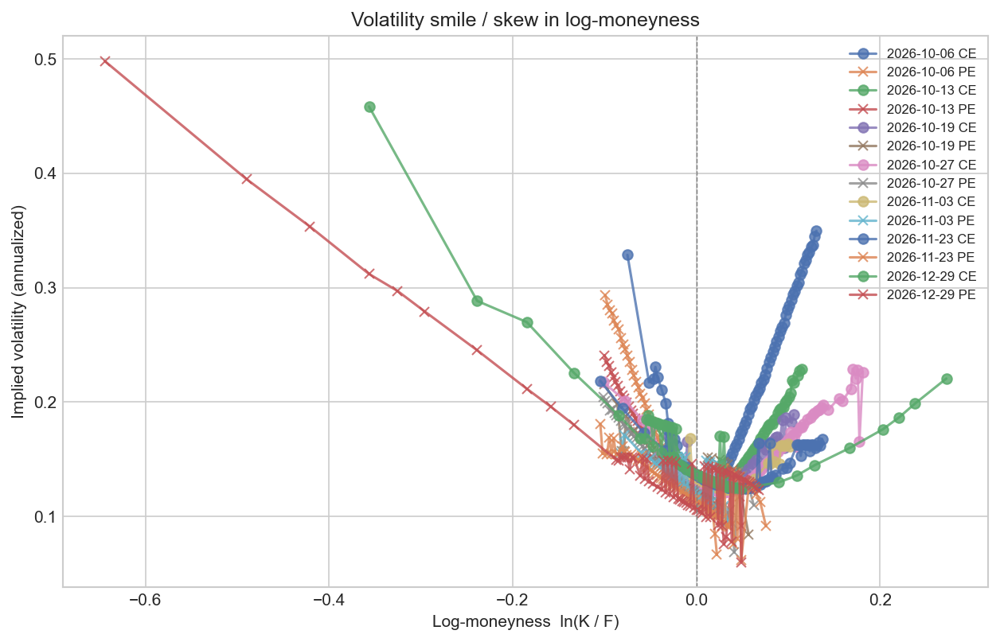
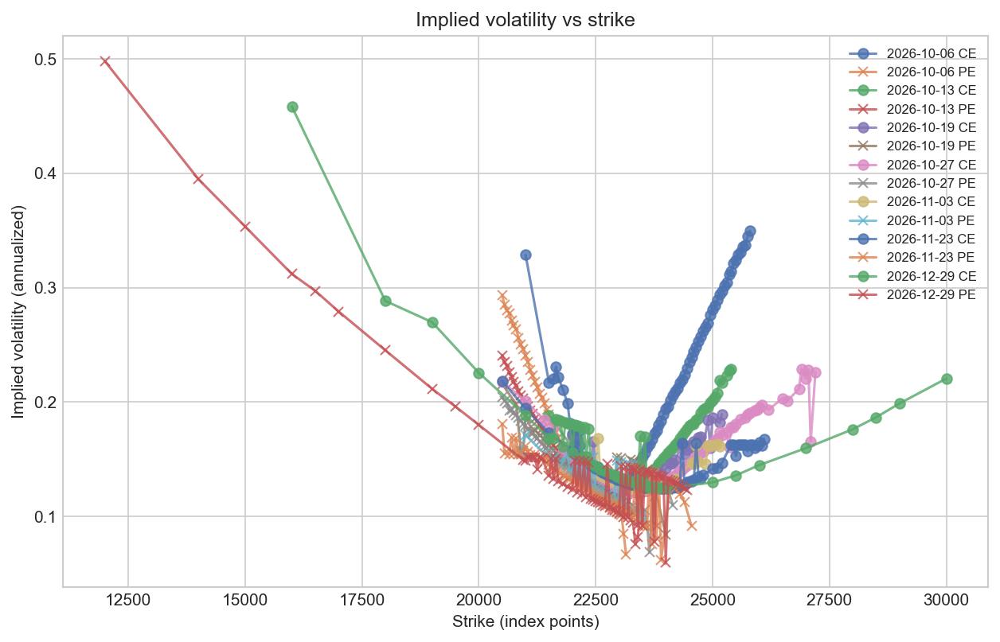

#### Put-Call Parity Diagnostic
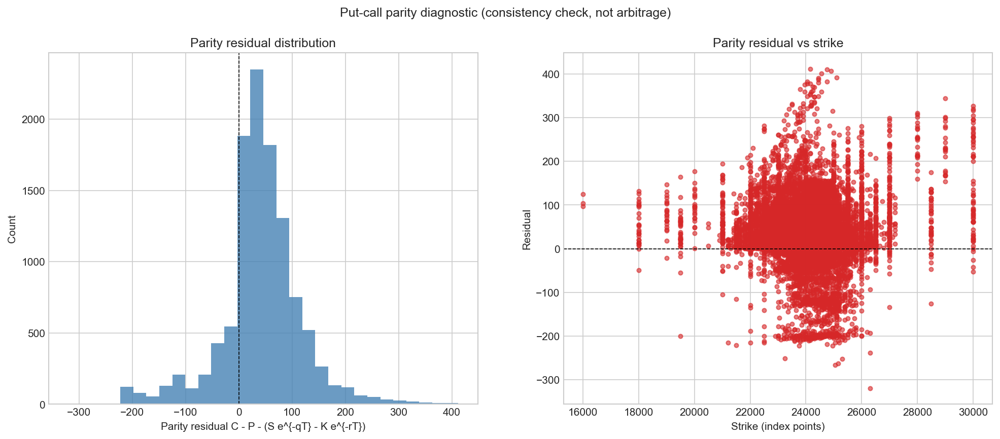

### Put-Call Parity

Matched call/put pairs are used to compute the parity residual:

$$
\text{residual} = C - P - \left( S e^{-qT} - K e^{-rT} \right)
$$

On synthetic Black-Scholes data, residuals are **< 1e-8**. On real data, residuals are small but non-zero due to bid-ask spreads, non-synchronous prices, and transaction costs. The diagnostic is provided as a consistency check, **not** an arbitrage test. Results are saved in `reports/tables/parity_residuals.csv` and `parity_summary.csv`.

---

## Methodology

### Black-Scholes-Merton

European call and put prices with continuous dividend yield $q$:

$$
C = S e^{-qT} N(d_1) - K e^{-rT} N(d_2)
$$

$$
P = K e^{-rT} N(-d_2) - S e^{-qT} N(-d_1)
$$

where $d_1 = \frac{\ln(S/K) + (r - q + \sigma^2/2)T}{\sigma\sqrt{T}}$, $d_2 = d_1 - \sigma\sqrt{T}$.

Analytical Greeks: Delta, Gamma, Vega, Theta, Rho.

### Implied Volatility

Inversion uses **Brent's method** with:
- No-arbitrage lower and upper price bounds.
- Automatic bracket expansion if the root is not initially bracketed.
- Round-trip repricing check with a relative tolerance.

Returns a structured `IVResult` (never a bare float) so failures are explicit.

### CRR Binomial Tree

Standard Cox-Ross-Rubinstein parameterisation:

$$
u = e^{\sigma\sqrt{\Delta t}}, \quad d = 1/u, \quad p = \frac{e^{(r-q)\Delta t} - d}{u - d}
$$

Backward induction with optional early exercise. Convergence to Black-Scholes is $O(1/N)$ with oscillatory behaviour for ATM options.

### Greeks Validation

Central finite differences on the Black-Scholes pricing function:

- Delta: $(P(S+h) - P(S-h)) / (2h)$
- Gamma: $(P(S+h) - 2P(S) + P(S-h)) / h^2$
- Vega: $(P(\sigma+h) - P(\sigma-h)) / (2h)$
- Rho: $(P(r+h) - P(r-h)) / (2h)$
- Theta: $-(P(T+h) - P(T-h)) / (2h)$ (sign flip to match calendar-time convention)

### Data Cleaning

Every filter step increments a counter in `DataQualityReport`. Filters include:
- Instrument type (`OPTIDX` only)
- Underlying symbol (`NIFTY`)
- Option type (`CE`, `PE`)
- Strike range
- Time to expiry range
- Positive volume
- Positive open interest (diagnostic only)
- Valid spot price

---

## Configuration

All settings live in `config.yaml`. Key sections:

- `project` — name, version, random seed.
- `paths` — input/output directories.
- `data` — filters, date range, instrument types.
- `market` — risk-free rate, dividend yield, day count, exercise style.
- `models` — Black-Scholes price field, CRR steps.
- `implied_vol` — solver bracket, tolerance, bracket expansion.
- `greeks` — finite-difference bumps and tolerances.
- `experiments` — which pricing experiments to run.
- `moneyness_buckets` — edges and labels for aggregations.
- `plots` — figure style, DPI, format.
- `logging` — level and format.

---

## Testing

The test suite (`tests/test_all.py`) covers:

- **Black-Scholes** — reference values from Haug (2007), put-call parity, degenerate limits, error handling.
- **Greeks** — analytical bounds, FD agreement for all five Greeks.
- **Implied Volatility** — round-trip recovery, bound rejection, input validation.
- **CRR Tree** — convergence to BS, parity, American vs European properties, error handling.
- **Analysis Pipeline** — derived columns, ATM estimation, pricing experiments, parity diagnostic.
- **Data Cleaning** — column normalisation, exclusion reasons.

All tests use synthetic data and require no network access.

---

## Caveats and Limitations

- **NSE data quality** — Bhavcopy files contain zero-volume contracts, missing spot values, and occasional formatting quirks. The pipeline handles these explicitly but cannot fix bad data.
- **Bhavcopy prices are not executable bid/ask quotes** — they are end-of-day settlement prices. The parity diagnostic ignores transaction costs, financing, and short-sale constraints.
- **Dividend yield and risk-free rate are assumptions** — both are configurable but fixed over the sample. In reality they vary over time.
- **CRR convergence is oscillatory** — even and odd step counts bracket the true price. The convergence test separates them.
- **No arbitrage enforcement** — the IV solver rejects prices outside no-arbitrage bounds, but does not enforce static arbitrage-free surfaces across strikes and expiries.

---

## Future Work

- Add stochastic volatility models (Heston, SABR) for comparison.
- Incorporate a term structure of interest rates and dividends.
- Extend to intraday option data.
- Improve automated NSE download robustness.
- Build an interactive dashboard for exploring the volatility surface.

---

## License

MIT License. See `LICENSE` for details.

---

## Acknowledgements

- NSE for providing the F&O Bhavcopy data.
- Espen Gaarder Haug for the reference option prices used in tests.
- The open-source Python ecosystem: NumPy, pandas, SciPy, Matplotlib, Seaborn, PyYAML, pytest.

---

*This project is for research and educational purposes. It is not financial advice.*
